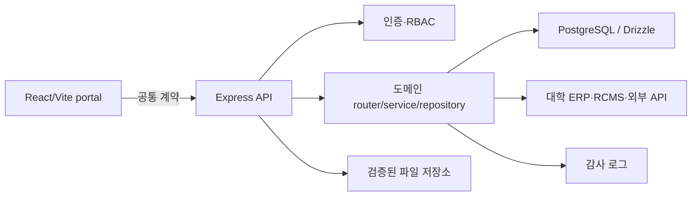

# 첨단산업 인재양성 부트캠프 통합운영 플랫폼 아키텍처

## 1. 목표와 경계

이 저장소는 공개 홈페이지와 교과·비교과·학생 이수·수혜·기업·예산·성과·CMS를
하나의 API와 PostgreSQL 데이터 모델로 운영한다.

- 대학 ERP/RCMS는 회계 및 실제 지급의 원장이다. 이 플랫폼은 내부 운영 상태와
  외부 참조번호만 보존한다.
- 브라우저의 `localStorage`와 `mockData`는 운영 데이터 저장소로 사용하지 않는다.
- 개인정보와 금융정보는 업무에 필요한 최소 항목만 저장한다. 계좌번호는 저장하지 않는다.
- 모든 주요 데이터는 사업연도(`business_year_id`)와 필요한 경우 학기(`term_id`)를 기준으로 조회한다.
- 운영 데이터는 `deleted_at`을 이용한 soft delete가 기본이다.

## 2. 실행 구조

- `artifacts/bootcamp-portal`: React UI, React Query, 생성된 API client
- `artifacts/api-server`: Express router → service → repository 계층
- `lib/api-zod`: 프론트와 서버가 공유하는 요청·응답 Zod 계약
- `lib/db/src/schema`: 도메인별 Drizzle 스키마
- `lib/api-spec`: 외부에 공개 가능한 OpenAPI 계약

router는 HTTP 변환과 인증/인가만, service는 검증·정책·transaction을, repository는
DB 질의만 담당한다.

## 3. 핵심 도메인

| 도메인 | 주요 엔터티 | 핵심 불변조건 |
| --- | --- | --- |
| 기준/권한 | business_year, term, code, user, role | 권한검사는 서버에서 수행 |
| 교과 | course_master, course_offering, curriculum, requirement | 마스터와 연도·학기 개설 분리 |
| 가져오기 | import_job, staging_row | staging → validation → preview → commit |
| 비교과 | program, program_session, application, attendance, assignment | 회차별 정원·기간·신청자격 검증 |
| 학생 이수 | student, learning_record, completion_assessment | boolean 저장 대신 규칙 계산, snapshot 보존 |
| 수혜 | benefit_policy, eligibility_rule, candidate, approval, payment | 정책·대상·승인·지급 분리, 금액 DB 관리 |
| 기업 | company_application, company, contact, expert, participation | 공개 신청부터 승인·확약까지 상태 추적 |
| 예산 | budget_allocation, execution, change_history | 외부 회계 원장 대체 금지, 금액변경 이력 필수 |
| 성과 | indicator, target, result, evidence | 공개 승인된 결과만 홈페이지 노출 |
| CMS | content_item, attachment | 공지·모집·소식·성과사례·자료실 통합 |
| 감사 | audit_log | 생성·수정·승인·삭제와 개인정보 접근 기록 |

## 4. 데이터 규칙

### 외부 데이터와 중복 방지

외부키가 있는 테이블은 `source_system`, `external_id`를 보존하고 두 값의 복합
unique index를 둔다. 가져오기 commit은 같은 키에 대해 idempotent upsert를 수행한다.
파일 해시와 행별 원문·정규화 결과도 import job에 보존한다.

### 이수 계산

교육과정은 버전과 요건으로 관리한다. 요건은 교과 학점, 필수 교과, 비교과 시간,
프로젝트, 현장실습, 인턴십 등의 유형과 비교 연산자를 가진다. 평가 시점의 입력,
규칙 버전, 충족/부족 항목, 진행률을 `completion_assessment.snapshot`에 저장한다.

### 금액과 snapshot

금액은 `numeric(15, 2)`를 사용한다. 장학금과 예산 계산의 정책·입력·결과는 승인 시점에
JSON snapshot으로 고정하고 이후 정책 변경으로 과거 결과가 바뀌지 않도록 한다.

## 5. API 규칙

- 기본 경로: `/api/v1`
- 성공 응답: 리소스 또는 `{ data, meta }`
- 오류 응답: `{ error: { code, message, fieldErrors?, requestId } }`
- 모든 body/query/path 입력은 `lib/api-zod` 계약으로 검증한다.
- 복수 행 변경과 import commit은 단일 DB transaction에서 처리한다.
- 목록 API는 cursor 또는 page 기반 pagination, 사업연도/학기 필터를 제공한다.
- 승인·지급·공개 같은 상태 전이는 일반 update와 분리된 명령 endpoint로 제공한다.
- 기존 UI 경로는 새 경로로 redirect해 호환한다.

## 6. 인증, 권한, 감사

지원 역할:

`PUBLIC`, `STUDENT`, `COMPANY_APPLICANT`, `COMPANY_MANAGER`,
`EDUCATION_STAFF`, `BENEFIT_STAFF`, `COMPANY_STAFF`, `BUDGET_STAFF`,
`PERFORMANCE_STAFF`, `CONTENT_EDITOR`, `REVIEWER`, `SYSTEM_ADMIN`, `AUDITOR`.

- 세션 또는 대학 SSO 연동 토큰을 서버에서 검증한다.
- middleware에서 인증을, 도메인 policy에서 리소스 단위 권한을 검사한다.
- 운영환경에서 mock login은 시작 시 거부한다.
- 개인정보 조회·수정·다운로드에는 대상, 목적, 행위자, request ID를 감사 로그로 남긴다.
- 파일은 허용 확장자, MIME, signature, 용량을 모두 검증하고 비공개 저장을 기본으로 한다.

## 7. transaction과 audit 패턴

service는 하나의 transaction에서 업무 변경과 audit insert를 함께 수행한다. audit에는
민감정보 원문을 넣지 않고 변경 필드와 마스킹된 before/after만 기록한다. 금액 변경은
별도의 immutable change history에도 기록한다.

## 8. 단계별 전환

1. 이 문서와 스키마 기준 확정
2. migration/seed 및 DB 검증
3. 인증·RBAC·감사·공통 오류
4. 교과·교육과정·가져오기
5. 비교과 프로그램·신청·출석·이수
6. 학생 부족요건 계산과 snapshot
7. 수혜자·기업
8. 예산·성과·CMS·파일
9. 프론트의 `storageService` 호출을 React Query API로 제거
10. 통합테스트, 보안점검, 운영·배포 문서

각 단계는 독립 migration, API 계약, 최소 단위/통합테스트, typecheck와 build 통과를
완료조건으로 한다.
